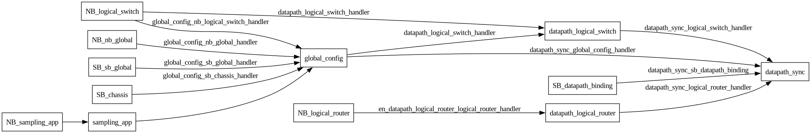
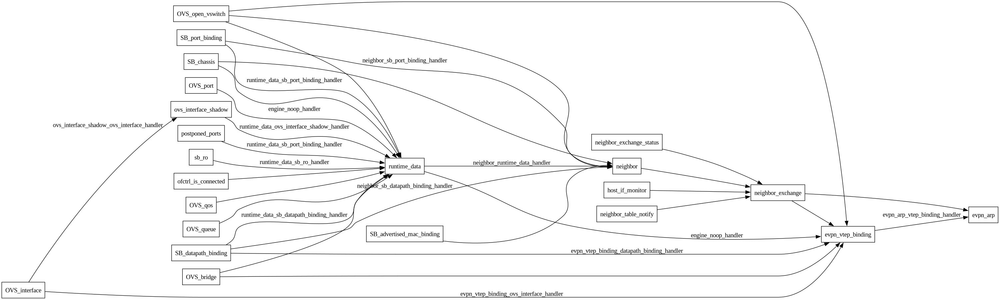
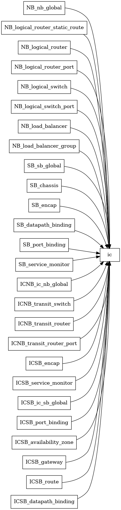

..
      Licensed under the Apache License, Version 2.0 (the "License"); you may
      not use this file except in compliance with the License. You may obtain
      a copy of the License at

          http://www.apache.org/licenses/LICENSE-2.0

      Unless required by applicable law or agreed to in writing, software
      distributed under the License is distributed on an "AS IS" BASIS, WITHOUT
      WARRANTIES OR CONDITIONS OF ANY KIND, either express or implied. See the
      License for the specific language governing permissions and limitations
      under the License.

      Convention for heading levels in OVN documentation:

      =======  Heading 0 (reserved for the title in a document)
      -------  Heading 1
      ~~~~~~~  Heading 2
      +++++++  Heading 3
      '''''''  Heading 4

      Avoid deeper levels because they do not render well.

==================================
OVN Incremental Processing Engine
==================================

The OVN Incremental Processing Engine is a framework designed to efficiently
handle changes in input data (e.g., Southbound DB tables, local OVSDB
interfaces) and update the desired state (e.g., OpenFlow rules) accordingly.
Instead of performing a full recomputation whenever an input changes, which can
be inefficient for large datasets, the engine tracks changes and processes them
incrementally.

Concepts
--------

The engine is composed of a Directed Acyclic Graph (DAG) of **engine nodes**.

- **Engine Node:** Represents a unit of data processing. Each node maintains
  its own data, which persists across main loop iterations.
- **Inputs:** Nodes can have inputs (dependencies) from other nodes.
- **Change Handlers:** For each input, a user-defined change handler function
  can be implemented. This function processes the changes from the input and
  updates the node's data.
- **Run Function:** If no change handler is defined for an input, or if the
  change handler returns `EN_UNHANDLED`, the node's `run` method is called to
  perform a full recomputation based on all inputs.

The engine facilitates:

- **Correctness:** By making dependencies explicit.
- **Maintainability:** By providing a structured way to implement complex
  logic.
- **Scalability:** By enabling fine-grained, incremental updates.

Engine Node State
~~~~~~~~~~~~~~~~~

The state of an engine node (`enum engine_node_state`) describes the validity
of its data after an engine run:

- `EN_STALE`: The data in the node is not up to date with the DB or its inputs.
  This is the initial state before the engine runs.
- `EN_UPDATED`: The node's data is valid and was updated during the last engine
  run. This indicates that downstream nodes may need to process these changes.
- `EN_UNCHANGED`: The node's data is valid and did not change during the last
  engine run. Downstream nodes can skip processing if they only depend on
  changed inputs.
- `EN_CANCELED`: Processing for this node was canceled during the last run.
  This usually triggers a full recomputation in the next iteration.

Input Handler Result
~~~~~~~~~~~~~~~~~~~~

Change handlers return a result (`enum engine_input_handler_result`) indicating
the outcome of processing an input change:

- `EN_UNHANDLED`: The change handler could not handle the input change.
  This forces the engine to fall back to a full recomputation of the node using
  its `run` method.
- `EN_HANDLED_UPDATED`: The change was successfully handled, and the node's
  data was updated as a result.
- `EN_HANDLED_UNCHANGED`: The change was successfully handled, but the node's
  data remained unchanged.

Usage of these return values allows the engine to optimize the flow of updates
through the graph.

Graph Visualization
-------------------

Understanding the dependencies between engine nodes is crucial for debugging
and optimization. OVN provides a mechanism to dump the engine graph in Graphviz
DOT format.

Dumping the Graph
~~~~~~~~~~~~~~~~~

Both `ovn-northd`, `ovn-controller` and `ovn-ic` support the
`--dump-inc-proc-graph` command-line option.

Full Graph Dump
+++++++++++++++

To dump the entire engine graph, simply pass the option without arguments:

.. code-block:: bash

   ovn-northd --dump-inc-proc-graph
   # or
   ovn-controller --dump-inc-proc-graph
   # or
   ovn-ic --dump-inc-proc-graph

This will output the full DAG definition to stdout.

Partial Graph Dump
++++++++++++++++++

For complex graphs, it can be useful to view only a subset of the nodes. One
can provide a specific node name as an argument to dump the graph leading up
to that node (including the node itself and its transitive dependencies).

.. code-block:: bash

   # Dump the graph for 'datapath_sync' node in ovn-northd
   ovn-northd --dump-inc-proc-graph=datapath_sync

   # Dump the graph for 'runtime_data' node in ovn-controller
   ovn-controller --dump-inc-proc-graph=runtime_data

   # Dump the graph for 'ic' node in ovn-ic
   ovn-ic --dump-inc-proc-graph=ic

This allows for focused analysis of specific parts of the processing pipeline.

Example Output
~~~~~~~~~~~~~~

The output is in DOT format and can be visualized using tools like `dot` from
the Graphviz suite.

.. code-block:: none

   digraph "Incremental-Processing-Engine" {
       rankdir=LR;
       NB_nb_global [style=filled, shape=box, fillcolor=white, label="NB_nb_global"];
       global_config [style=filled, shape=box, fillcolor=white, label="global_config"];
       northd [style=filled, shape=box, fillcolor=white, label="northd"];
       NB_nb_global -> global_config [label="global_config_nb_global_handler"];
       global_config -> northd [label="northd_global_config_handler"];
   }

Edges are labeled with the name of the change handler function if one is
registered for that dependency.

The DOT output can be converted to an image (e.g., PNG) using the `dot` utility
from Graphviz:

.. code-block:: bash

   ovn-northd --dump-inc-proc-graph | dot -Tpng -o engine_graph.png
   ovn-controller --dump-inc-proc-graph | dot -Tpng -o engine_graph.png
   ovn-ic --dump-inc-proc-graph | dot -Tpng -o engine_graph.png

Visual representation of the ovn-northd incremental processing engine
dependencies up to the `datapath_sync` node:

.. code-block:: bash

   ovn-northd --dump-inc-proc-graph=datapath_sync | dot -Tpng -o datapath-sync-graph.png

Visual representation of the ovn-controller incremental processing engine
dependencies up to the `evpn_arp` node:

.. code-block:: bash

   ovn-controller --dump-inc-proc-graph=evpn_arp | dot -Tpng -o evpn-arp-graph.png

Visual representation of the ovn-ic incremental processing engine
dependencies up to the `ic` node:

.. code-block:: bash

   ovn-ic --dump-inc-proc-graph=ic | dot -Tpng -o ic-graph.png

Implementation Details
----------------------

The engine core is implemented in `lib/inc-proc-eng.c` and
`lib/inc-proc-eng.h`.

Key Structures
~~~~~~~~~~~~~~

- `struct engine_node`: The base structure for a node. Contains inputs, data,
  state, and callback functions (`run`, `init`, `cleanup`).
- `struct engine_node_input`: Describes a dependency on another node and the
  associated change handler.

Usage Guidelines
----------------

When working with the incremental processing engine:

1. **Focus on Data:** Design nodes based on the data they maintain.
2. **Explicit Dependencies:** Avoid using global variables. All inputs should
   be explicitly defined in the graph.
3. **Handle All Changes:** Ensure that for every input, either a change handler
   updates the node correctly, or the `run` method recomputes it entirely.
   Returning `EN_UNHANDLED` from a handler triggers recomputation.
