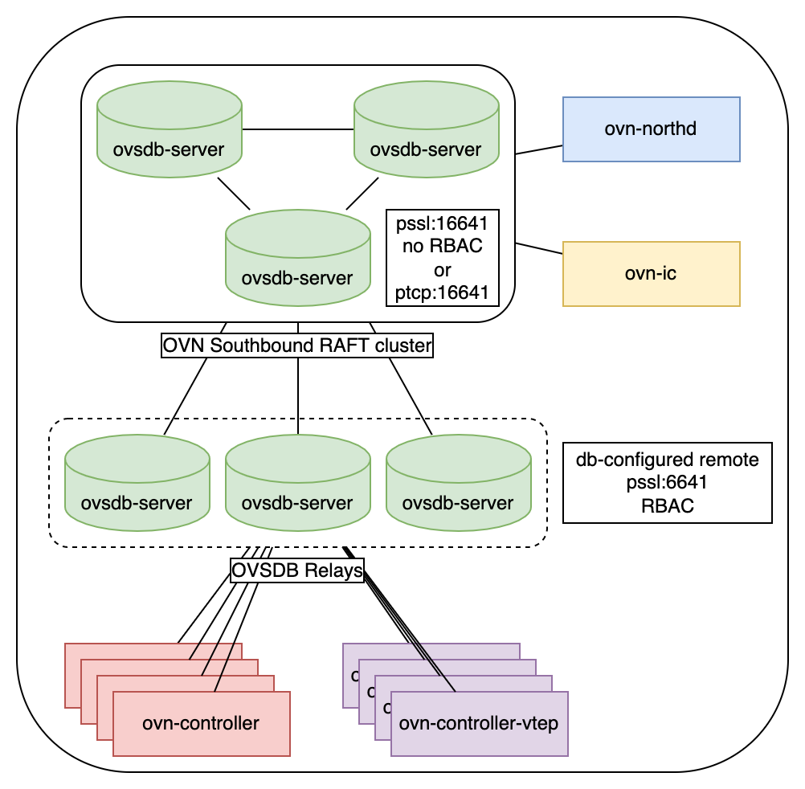
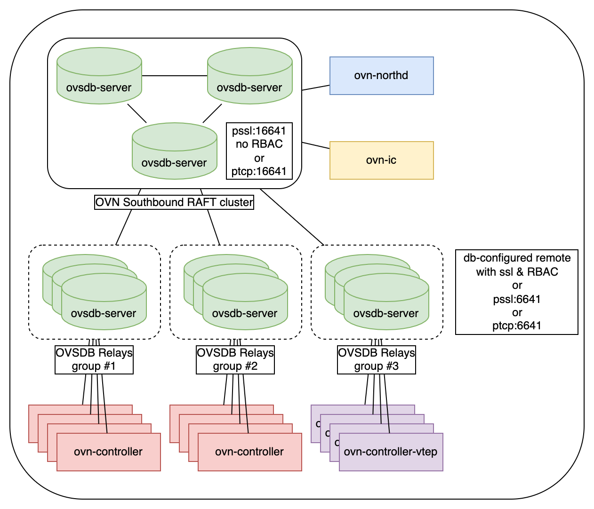
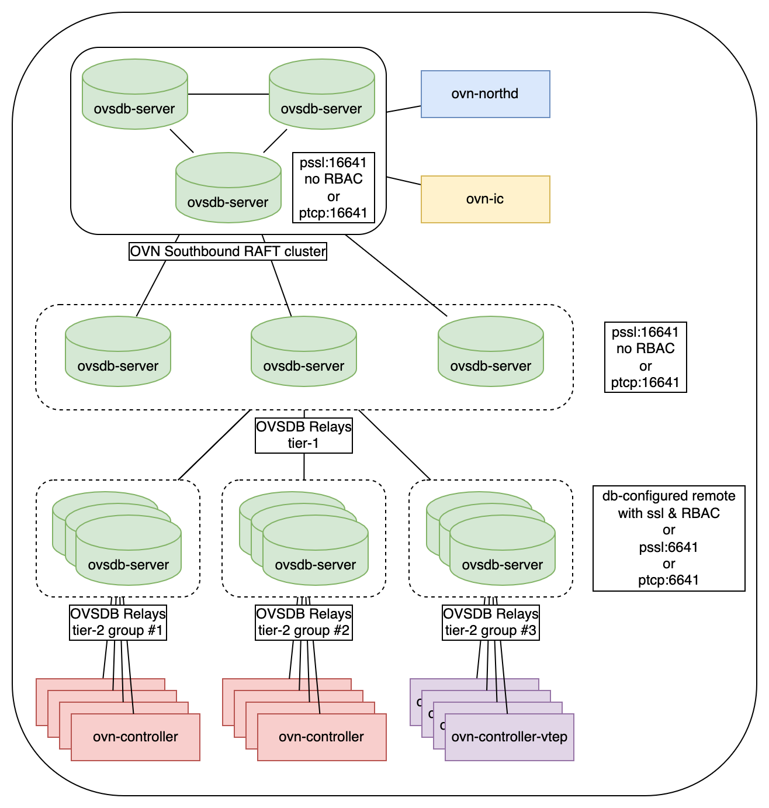

..
      Licensed under the Apache License, Version 2.0 (the "License"); you may
      not use this file except in compliance with the License. You may obtain
      a copy of the License at

          http://www.apache.org/licenses/LICENSE-2.0

      Unless required by applicable law or agreed to in writing, software
      distributed under the License is distributed on an "AS IS" BASIS, WITHOUT
      WARRANTIES OR CONDITIONS OF ANY KIND, either express or implied. See the
      License for the specific language governing permissions and limitations
      under the License.

      Convention for heading levels in OVN documentation:

      =======  Heading 0 (reserved for the title in a document)
      -------  Heading 1
      ~~~~~~~  Heading 2
      +++++++  Heading 3
      '''''''  Heading 4

      Avoid deeper levels because they do not render well.

==========================================
Running OVN Southbound DB with OVSDB Relay
==========================================

This tutorial shows how to run and configure OVN database daemons to offload
``ovn-controller``-related read workload from OVN Southbound database
cluster.  This is useful in large-scale deployments with a big number of
ovn-controllers.

---------------------
Design considerations
---------------------

The design assumes there is a working OVSDB RAFT cluster.  Configure this
cluster to accept connections from ``ovn-northd``, ``ovn-ic`` and
``ovsdb-server``-relay processes.  All these processes require direct access to
OVN Southbound DB cluster.  Other clients (``ovn-controller`` and
``ovn-controller-vtep``) connect to relay ovsdb servers.  These relay servers
maintain connections to ``ovn-controllers``, send out database updates and
forward DB updates to database cluster.

.. note::

   In this doc the set of OVSDB Relay servers, which has same parameters:
   upstream servers, remotes and clients, will be called a *group*.

OVSDB Relay supports creating multi-tier deployment, where one set (group) of
relay ovsdb-servers is connected to ovsdb raft cluster, the other set of relay
ovsdb-servers can be connected to the first set of relays and this can be
repeated multiple times horizontally (multiple groups connected to one group)
and/or vertically (multiple groups connected one-by-one in a chain).

OVN Southbound OVSDB cluster must be configured with at least one remote, which
allows OVSDB Relay servers to connnect to it.  This remote must not have
configured RBAC rules.  RBAC rules can be configured to be checked on the OVSDB
Relay servers, which are used to connect to ovn-controller and
ovn-controller-vtep.

------------------
Deployment options
------------------

Three variants of deployment will be covered in this tutorial:

#. :ref:`One-group deployment<one_group>`: one OVSDB Relays group connected to
   OVSDB cluster.
#. :ref:`Multi-group deployment<multi_group>`: multiple groups of OVSDB Relays
   connected to OVSDB cluster.
#. :ref:`Two-tier multi-group deployment<two_tier_multi_group>`: one group of
   OVSDB Relays connected to OVSDB cluster and another multiple OVSDB Relay
   groups connected to the first group.

.. _one_group:

~~~~~~~~~~~~~~~~~~~~
One-group deployment
~~~~~~~~~~~~~~~~~~~~

Example commands to run this configuration:

Start SB cluster and ovn-northd:

::

  # start OVN_Southbound cluster
  /usr/share/ovn/scripts/ovn-ctl start_sb_ovsdb \
    --db-sb-cluster-local-addr=127.0.0.1 \
    -- --remote=ptcp:16642

  # start ovn-northd and connect directly to cluster
  /usr/share/ovn/scripts/ovn-ctl start_northd \
    --ovn-manage-ovsdb=no \
    --ovn-northd-nb-db=... \
    --ovn-northd-sb-db=tcp:127.0.0.1:16642

To use **TCP** between ovn-controller and OVSDB Relay:

::

  # start OVSDB Southbound Relay and connect to cluster
  /usr/share/ovn/scripts/ovn-ctl start_sb_relay_ovsdb \
    --db-sb-relay-remote=tcp:127.0.0.1:16642 \
    -- --remote=ptcp:6642

  # start ovn-controller and connect to OVSDB Relay
  ovs-vsctl set external_ids:ovn-remote="tcp:127.0.0.1:6642"
  /usr/share/ovn/scripts/ovn-ctl start_controller

To use **SSL** between ovn-controller and OVSDB Relay:

::

  # start OVSDB Southbound Relay and connect to cluster
  /usr/share/ovn/scripts/ovn-ctl start_sb_relay_ovsdb \
    --db-sb-relay-remote=tcp:127.0.0.1:16642 \
    --ovn-sb-relay-db-ssl-key=/path/to/ovsdb/relay/ssl-key.pem \
    --ovn-sb-relay-db-ssl-cert=/path/to/ovsdb/relay/ssl-cert.pem \
    --ovn-sb-relay-db-ssl-ca-cert=/path/to/ovsdb/relay/ssl-ca-cert.pem \
    -- --remote=pssl:6642

  # start ovn-controller and connect to OVSDB Relay
  ovs-vsctl set external_ids:ovn-remote="ssl:127.0.0.1:6642"
  ovs-vsctl set-ssl <...>
  /usr/share/ovn/scripts/ovn-ctl start_controller

To use **SSL with RBAC** between ovn-controller and OVSDB Relay:

::

  # configure RBAC. create RBAC-enabled connection in SB DB:
  ovn-sbctl set-connection role=ovn-controller pssl:6642

  # start OVSDB Southbound Relay and connect to cluster
  /usr/share/ovn/scripts/ovn-ctl start_sb_relay_ovsdb \
    --db-sb-relay-remote=tcp:127.0.0.1:16642 \
    --ovn-sb-relay-db-ssl-key=/path/to/ovsdb/relay/ssl-key.pem \
    --ovn-sb-relay-db-ssl-cert=/path/to/ovsdb/relay/ssl-cert.pem \
    --ovn-sb-relay-db-ssl-ca-cert=/path/to/ovsdb/relay/ssl-ca-cert.pem

  # start ovn-controller and connect to OVSDB Relay
  ovs-vsctl set external_ids:ovn-remote="ssl:127.0.0.1:6642"
  /usr/share/ovn/scripts/ovn-ctl start_controller

This is the most simple deployment, which can be used even in small-scale
deployments to remove ovn-controller-related load from OVSDB cluster.  All
cluster leader elections will not be noticed by ovn-controllers, no
reconnections and full DB re-sync, which can trigger avalanche-like load on
OVSDB cluster will not take place.  RAFT cluster will maintain only connections
to ovn-northd, ovsdb-relay servers and, optionally, ovn-ic.

.. note::

   Check :ref:`this documentation<ovn_rbac>` for more details about RBAC
   configuration.

.. _multi_group:

~~~~~~~~~~~~~~~~~~~~~~
Multi-group deployment
~~~~~~~~~~~~~~~~~~~~~~

The difference between this deployment option and "one-group" is that it is
possible to dedicate different groups of OVSDB Relays to serve different sets
of ovn-controllers.

This deployment scenario can be used when it is needed to bring OVSDB Relays
closer to ovn-controllers (POD), split the Relay servers by some tag or split
large OVSDB Relay group by multiple small groups.

OVSDB cluster and Relays configuration is similar to the first scenario. The
difference is in ovn-controller ``remote`` configuration: for ovn-controller
from different groups appropriate ``ovn-remote`` external IDs should be
configured:

Group 1:
::

  ovs-vsctl set open . external_ids:ovn-remote=ssl:10.0.0.10:6642,ssl:10.0.0.11:6642

Group 2:
::

  ovs-vsctl set open . external_ids:ovn-remote=ssl:10.0.0.20:6642,ssl:10.0.0.21:6642

And so on. It is adviced to configure at least two OVSDB Relay servers for
ovn-controller if high-avalability is important.

.. _two_tier_multi_group:

~~~~~~~~~~~~~~~~~~~~~~~~~~~~~~~
Two-tier multi-group deployment
~~~~~~~~~~~~~~~~~~~~~~~~~~~~~~~

This deployment scenario can be useful if the count of OVSDB Relay groups from
previous (multi-group) scenario becomes an issue for the OVSDB cluster and
brings unwanted load on it.  Deploy an intermediate group of OVSDB Relay
servers to have just N connections on the cluster ovsdb-servers (where N is a
number of Relay servers in this group), while other OVSDB Relay groups connect
to this "intermediate" group.

This extra level of OVSDB Relay servers gives more abilities of scale by the
cost of the increased latency of writes and DB updates.

Configuration of OVSDB cluster is similar to the first scenario. Commands to
start "intermediate" OVSDB Relay:

::

  /usr/share/ovn/scripts/ovn-ctl start_sb_relay_ovsdb \
    --db-sb-relay-remote=tcp:127.0.0.1:16642 \
    --db-sb-relay-use-remote-in-db=no \
    --ovn-sb-relay-db-ssl-key=/path/to/ovsdb/relay/ssl-key.pem \
    --ovn-sb-relay-db-ssl-cert=/path/to/ovsdb/relay/ssl-cert.pem \
    --ovn-sb-relay-db-ssl-ca-cert=/path/to/ovsdb/relay/ssl-ca-cert.pem \
    -- --remote=pssl:26642

.. note::
  OVSDB Relay "intermediate" servers should not use listening RBAC-enabled
  remote.  If RBAC is used, it should be configured on the OVSDB Relay servers
  to which ovn-controller and ovn-controller-vtep are connected.

Next, start "last-level" OVSDB Relay servers, to which ovn-controllers would be
connected.

To use **SSL with RBAC** between ovn-controller and OVSDB Relay:

::

  # configure RBAC. create RBAC-enabled connection in SB DB:
  ovn-sbctl set-connection role=ovn-controller pssl:6642

  # start OVSDB Southbound Relay and connect to intermediate OVSDB Relay group
  # start as many OVSDB Relays as needed.
  /usr/share/ovn/scripts/ovn-ctl start_sb_relay_ovsdb \
    --db-sb-relay-remote=tcp:127.0.0.1:26642 \
    --ovn-sb-relay-db-ssl-key=/path/to/ovsdb/relay/ssl-key.pem \
    --ovn-sb-relay-db-ssl-cert=/path/to/ovsdb/relay/ssl-cert.pem \
    --ovn-sb-relay-db-ssl-ca-cert=/path/to/ovsdb/relay/ssl-ca-cert.pem

  # start ovn-controller and connect to appropriate OVSDB Relay servers
  ovs-vsctl set external_ids:ovn-remote="ssl:127.0.0.1:6642"
  /usr/share/ovn/scripts/ovn-ctl start_controller

.. warning::
   OVSDB Relay feature was added in openvswitch 2.16.  Ensure your deployment
   uses appropriate openvswitch version to utilize this feature.

.. note::
   More details about OVSDB Relay can be found in `Open vSwitch OVSDB Relay
   documentation <https://docs.openvswitch.org/en/latest/topics/ovsdb-relay/>`_.
